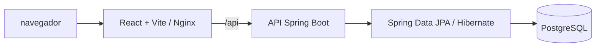

# ClassHub

**Gestão escolar em um só lugar.** O ClassHub reúne secretaria, professores e alunos em uma aplicação web para acompanhar a rotina acadêmica: turmas, horários, frequência, notas, boletins, calendário, ocorrências e achados e perdidos.

> Projeto acadêmico desenvolvido para a ETEC por Guilherme, Luiz e Thiago.

## Índice

- [O que o sistema oferece](#o-que-o-sistema-oferece)
- [Como funciona](#como-funciona)
- [Tecnologias](#tecnologias)
- [Estrutura do repositório](#estrutura-do-repositório)
- [Executar no computador](#executar-no-computador)
- [Acessar a aplicação](#acessar-a-aplicação)
- [API](#api)
- [Testes e build](#testes-e-build)
- [Configuração](#configuração)
- [Limitações conhecidas](#limitações-conhecidas)

## O que o sistema oferece

| Área | Recursos disponíveis |
| --- | --- |
| Secretaria | Cadastro de alunos, professores, séries, turmas, disciplinas e vínculos; horários; calendário; fechamento de bimestre; achados e perdidos. |
| Professor | Painel, consulta de alunos, horários, chamada, lançamento de notas e registro de ocorrências. |
| Aluno | Painel, notas, faltas, boletim, horários, calendário, ocorrências e mural de achados e perdidos. |

A interface adapta navegação e páginas ao perfil autenticado. O sistema usa português brasileiro e datas no formato local na interface; a API recebe datas como `YYYY-MM-DD`.

## Como funciona



No desenvolvimento, o Vite serve a interface e encaminha chamadas iniciadas por `/api` para o backend. No Compose, o Nginx da imagem frontend faz esse encaminhamento dentro da rede Docker. A API valida os dados, aplica as regras de negócio e persiste os registros com JPA/Hibernate.

O login retorna um JWT. O frontend guarda o token na sessão do navegador e o envia como `Authorization: Bearer <token>` nas chamadas seguintes. O backend valida o token e usa seu perfil e identificador para autenticar a requisição.

## Tecnologias

| Camada | Tecnologias |
| --- | --- |
| Interface | React 18, React Router 6, Vite 5 e CSS próprio |
| API | Java 21, Spring Boot 4, Spring MVC, Spring Security, Bean Validation e Spring Data JPA |
| Autenticação | JWT com JJWT |
| Banco | PostgreSQL 16; H2 nos testes automatizados |
| Execução | Docker, Docker Compose e Nginx |

## Estrutura do repositório

```text
.
├── api/                  API Spring Boot, domínio, serviços e testes
├── frontend/             Aplicação React, páginas e componentes
├── docker-compose.yaml   Banco, API e interface para execução local
├── start.sh              Inicialização com integração opcional ao Tailscale Funnel
└── stop.sh               Parada dos serviços e do Tailscale Funnel
```

Os modelos JPA ativos ficam em `api/src/main/java/com/classhub/api/domain`. A pasta `api/.../Models` contém modelos legados e não representa o domínio ativo.

## Executar no computador

### Opção recomendada: Docker Compose

Este caminho inicia PostgreSQL, backend e frontend sem exigir instalação local de Java ou Node.js.

**Pré-requisitos:** Docker Desktop ou Docker Engine com Docker Compose v2, além de portas `5173`, `5432` e `8080` livres.

1. Abra um terminal na raiz do repositório:

   ```bash
   cd ClassHub
   ```

2. Construa as imagens e inicie os serviços:

   ```bash
   docker compose up --build -d
   ```

   Na primeira execução, o Docker baixa as imagens e instala as dependências, então pode levar alguns minutos.

3. Confira o estado dos containers:

   ```bash
   docker compose ps
   ```

4. Aguarde o backend ficar saudável e abra:

   - Aplicação: [http://localhost:5173](http://localhost:5173)
   - Saúde da API: [http://localhost:8080/health](http://localhost:8080/health)

   A resposta esperada da API é `{"status":"UP"}`.

5. Para acompanhar inicialização e erros:

   ```bash
   docker compose logs -f backend frontend db
   ```

   Encerre a visualização dos logs com `Ctrl+C`; isso não para os containers.

Para parar os serviços e preservar os dados do banco:

```bash
docker compose down
```

Os dados do PostgreSQL ficam no volume Docker `pgdata` e continuam disponíveis após parar os containers. **Remover o volume apaga o banco local:** `docker compose down -v`.

### Execução manual para desenvolvimento

Use este caminho quando quiser rodar a API e a interface fora de containers. É necessário ter Docker Compose, Java 21 e Node.js 18 ou superior com npm.

1. Inicie somente o PostgreSQL:

   ```bash
   docker compose up -d db
   ```

   A configuração local do Compose cria o banco `classhubdb`, usuário `root` e senha `root` em `localhost:5432`.

2. Em um terminal, configure as variáveis e inicie a API:

   ```bash
   cd api
   export APP_SEED_DEMO_USERS=true
   export APP_JWT_SECRET=classhub-development-only-secret-change-this-before-sharing
   SPRING_DATASOURCE_URL=jdbc:postgresql://localhost:5432/classhubdb \
   SPRING_DATASOURCE_USERNAME=root \
   SPRING_DATASOURCE_PASSWORD=root \
   ./mvnw spring-boot:run
   ```

   No Windows PowerShell, use:

   ```powershell
   cd api
   $env:SPRING_DATASOURCE_URL = "jdbc:postgresql://localhost:5432/classhubdb"
   $env:SPRING_DATASOURCE_USERNAME = "root"
   $env:SPRING_DATASOURCE_PASSWORD = "root"
    $env:APP_SEED_DEMO_USERS = "true"
    $env:APP_JWT_SECRET = "classhub-development-only-secret-change-this-before-sharing"
   .\mvnw.cmd spring-boot:run
   ```

   A API inicia em `http://localhost:8080`. O Hibernate usa `ddl-auto=update` para atualizar o schema local.

3. Em outro terminal, instale as dependências e inicie a interface:

   ```bash
   cd frontend
   npm ci
   npm run dev
   ```

   Acesse [http://localhost:5173](http://localhost:5173). O proxy do Vite envia `/api/...` para `http://localhost:8080/...`.

4. Para criar uma versão estática local da interface:

   ```bash
   cd frontend
   npm run build
   npm run preview
   ```

### Login de demonstração

Quando `app.seed-demo-users=true` (ativado no Compose local), a API cria dados e contas demonstrativas na primeira inicialização:

| Perfil | E-mail | Senha |
| --- | --- | --- |
| Professor | `professor@classhub.local` | `professor123` |
| Aluno | `aluno@classhub.local` | `aluno123` |
| Secretaria/administração | `funcionario@classhub.local` | `funcionario123` |

Essas credenciais são somente para desenvolvimento local. Não as use em um ambiente acessível pela internet.

## Acessar a aplicação

A navegação varia conforme o perfil:

- **Professor:** chamada, notas, ocorrências, consulta de alunos e horários.
- **Aluno:** notas, frequência, boletim, horários, calendário, ocorrências e achados e perdidos.
- **Secretaria/administração:** cadastros acadêmicos, horários, calendário, fechamento de bimestre e achados e perdidos.

As páginas de cada perfil são guardadas no frontend. As requisições da API, por sua vez, exigem autenticação, com exceção das rotas explicitamente públicas, como login e saúde.

## API

O endereço usado pelo navegador é `/api`. O backend aceita rotas com e sem esse prefixo; o proxy local e o Nginx removem `/api` antes de encaminhar a requisição.

Rotas principais disponíveis no backend:

| Recurso | Rotas |
| --- | --- |
| Autenticação | `POST /auth/login`, `POST /auth/recuperar-senha` |
| Alunos | `GET /alunos`, `GET /alunos/{id}`, `POST /alunos`, `PUT /alunos/{id}`, `PUT /alunos/{id}/turma`, `DELETE /alunos/{id}` |
| Professores | `GET /professores`, `POST /professores`, `PUT /professores/{id}`, `DELETE /professores/{id}` |
| Estrutura | CRUD de `/series`, `/turmas` e `/disciplinas`; vínculos em `GET/POST /vinculos` e `DELETE /vinculos/{id}` |
| Horários | `GET /horarios/turma/{turmaId}`, `GET /horarios/professor/{professorId}`, `POST /horarios`, `DELETE /horarios/{id}` |
| Frequência | `GET /presencas`, `POST /presencas/lote` |
| Notas e boletins | `GET/POST /notas`, `GET /notas/aluno/{alunoId}`, `PUT/DELETE /notas/{id}`, `POST /boletins/gerar`, `GET /boletins/aluno/{alunoId}`, `GET /boletins/aluno/{alunoId}/pdf` |
| Ocorrências | `GET/POST /ocorrencias`, `PUT /ocorrencias/{id}`, `PUT /ocorrencias/{id}/encerrar`, `DELETE /ocorrencias/{id}` |
| Achados e perdidos | `GET/POST /achados-perdidos`, `PUT /achados-perdidos/{id}`, `PUT /achados-perdidos/{id}/devolver`, `DELETE /achados-perdidos/{id}` |
| Calendário | `GET/POST /calendario`, `PUT/DELETE /calendario/{id}` |
| Saúde | `GET /health` |

Endpoints de lista aceitam filtros por query string quando implementados, por exemplo `GET /presencas?alunoId=1` e `GET /calendario?anoLetivo=2026&mes=9`. Os DTOs em `api/src/main/java/com/classhub/api/dto/ApiDtos.java` definem campos, formatos e validações de cada payload.

Exemplo de login:

```bash
curl -X POST http://localhost:8080/auth/login \
  -H 'Content-Type: application/json' \
  -d '{"email":"professor@classhub.local","senha":"professor123"}'
```

As respostas de erro da API usam o campo `mensagem`. Em geral, validação retorna `400`, recurso inexistente `404`, conflito de unicidade `409` e regra de negócio inválida `422`.

Os controllers em `api/src/main/java/com/classhub/api/Controller` e os DTOs em `api/src/main/java/com/classhub/api/dto/ApiDtos.java` são a referência para o contrato atual da API.

## Testes e build

Execute os testes do backend:

```bash
cd api
./mvnw test
```

No Windows PowerShell:

```powershell
cd api
.\mvnw.cmd test
```

Gere o pacote executável da API:

```bash
cd api
./mvnw package
```

O arquivo JAR é gerado em `api/target/`. Para validar o frontend:

```bash
cd frontend
npm ci
npm run build
```

## Configuração

| Variável | Uso | Valor local padrão |
| --- | --- | --- |
| `SPRING_DATASOURCE_URL` | JDBC URL do PostgreSQL | `jdbc:postgresql://localhost:5432/classhubdb` |
| `SPRING_DATASOURCE_USERNAME` | Usuário do banco | `root` no Compose local |
| `SPRING_DATASOURCE_PASSWORD` | Senha do banco | `root` no Compose local |
| `APP_JWT_SECRET` | Chave de assinatura dos tokens | Definida para uso local no Compose; obrigatória fora dele |
| `APP_CORS_ALLOWED_ORIGINS` | Origens aceitas pelo CORS | Configurada no `docker-compose.yaml` |
| `APP_SEED_DEMO_USERS` | Cria dados e contas de demonstração na inicialização | `true` no Compose local; defina `false` fora do desenvolvimento |
| `VITE_API_BASE_URL` | Prefixo da API usado no frontend | `/api` |
| `VITE_DEV_API_TARGET` | Destino do proxy do Vite | `http://localhost:8080` |

O arquivo `frontend/.env.example` pode ser copiado para `frontend/.env` para ajustar a URL da API no desenvolvimento. Variáveis `VITE_*` são incorporadas ao bundle durante o build.

Os valores de banco e JWT definidos no Compose servem apenas para desenvolvimento. Fora do Compose, a API exige `APP_JWT_SECRET`; configure uma chave própria com pelo menos 32 bytes e origens CORS restritas. O schema do backend é atualizado pelo Hibernate; os testes usam H2 em memória com `create-drop`.

## Limitações conhecidas

- A recuperação de senha ainda não está disponível. A tela informa isso e orienta o usuário a procurar a secretaria; nenhum e-mail de redefinição é enviado.
- Ao fechar um bimestre, a secretaria informa as datas de início e fim usadas para calcular a frequência. Fechamentos anteriores que não tenham esse intervalo precisam ser refeitos para liberar o boletim.
- As senhas listadas acima e as senhas iniciais definidas ao cadastrar contas são somente para demonstração local. Configure um fluxo seguro de credenciais antes de disponibilizar o sistema a usuários reais.
- `start.sh` não é necessário para desenvolvimento local: além do Compose, ele configura o Tailscale Funnel no host. Para uso local, prefira `docker compose up --build -d`.
